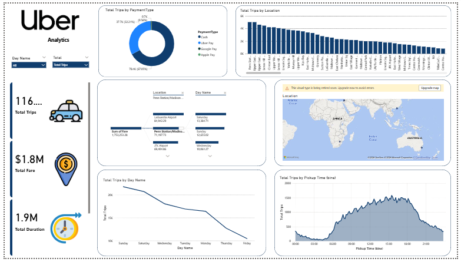

## 📊 Uber Analytics Dashboard

This project presents an **interactive Power BI dashboard** designed to analyze Uber trip data and extract actionable business insights related to **demand patterns, pricing trends, user behavior, and operational performance**.

### Dashboard Preview

### 🔍 Key Insights
- Total Trips: ~116.9K
- Total Fare: ~$1.8M
- Total Duration: ~1.9M minutes
- Total Distance: ~393.9K

### 📈 Dashboard Features
- Trips analysis by **payment type, location, day name, and pickup time**
- Interactive **KPIs, slicers, and filters**
- Star schema data modeling (fact & dimension tables)
- Dynamic measures using **DAX**
- Visuals include donut charts, bar charts, line charts, area charts, maps, and decomposition trees

### 🛠️ Tools & Technologies
- Power BI
- Power Query (Data Preparation)
- DAX (Calculated Measures & KPIs)
- Data Modeling (Star Schema)

### 🎯 Outcome
The dashboard enables stakeholders to quickly identify **high-demand locations, peak hours, and revenue trends**, supporting data-driven decision-making in urban mobility and transportation services.
